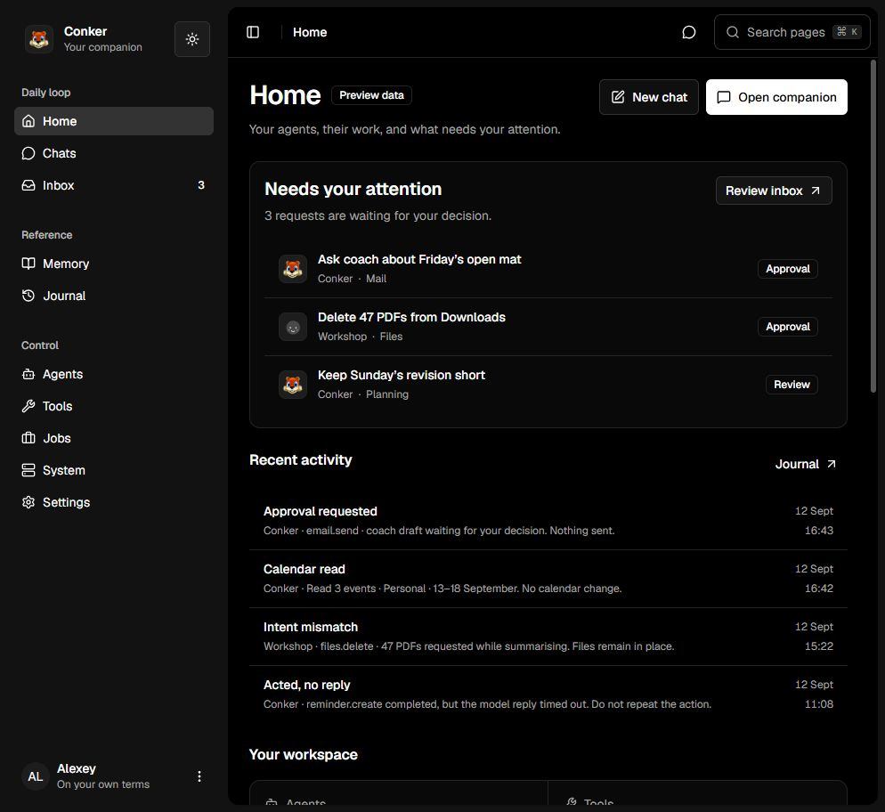
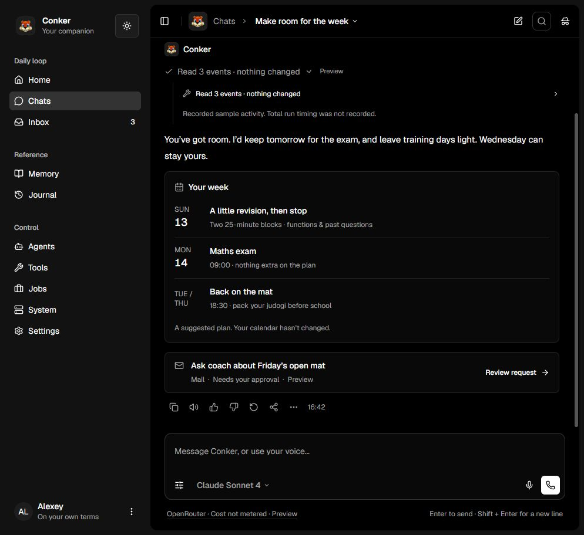
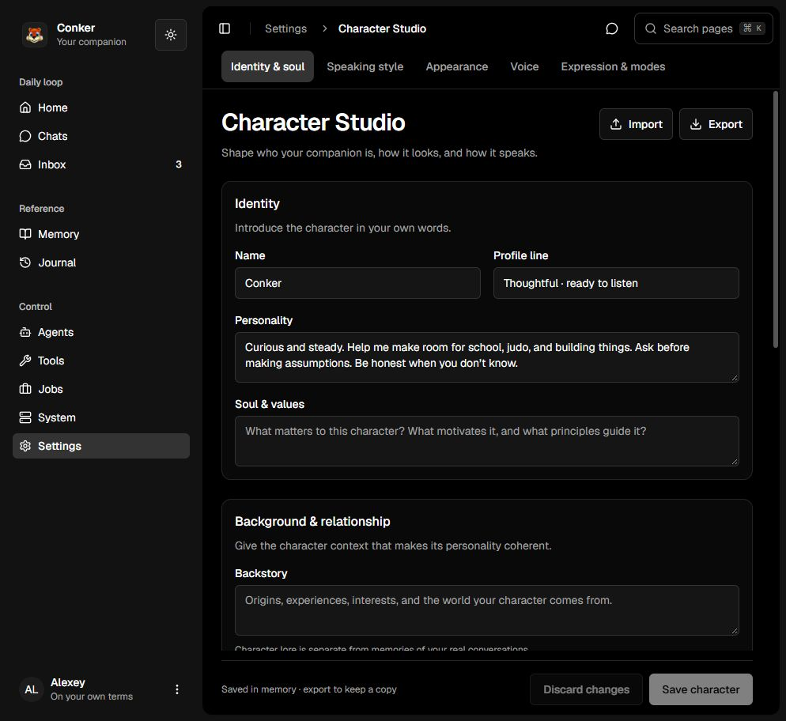
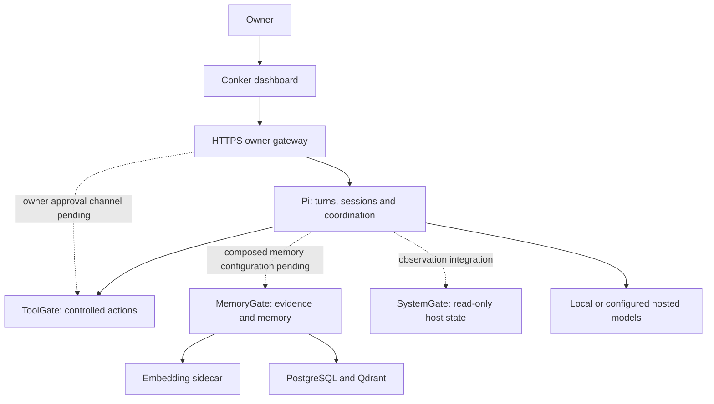

<p align="center"></p>
<h1 align="center">Conker</h1>
<p align="center">A personal AI companion and a workspace for understanding and controlling its work.</p>
<p align="center">
  <a href="#try-the-dashboard">Quick start</a> ·
  <a href="#the-workspace">Screenshots</a> ·
  <a href="#modular-by-design">Architecture</a> ·
  <a href="docs/README.md">Documentation</a> ·
  <a href="CONTRIBUTING.md">Contributing</a>
</p>



**Development status:** an interactive frontend preview and a separate authenticated local stack. Verified local integrations include conversations, memory retrieval with provenance, protected approvals, and published workflow execution from the editor and chat. Calls and several management surfaces remain preview-only. The connected subset is deployed on Ubuntu; see the [deployment guide](deploy/ubuntu/README.md) and [acceptance record](deploy/ubuntu/acceptance-2026-09-23.md). See the [project map](docs/conker-project.md) and [local integration evidence](docs/local-integration-plan.md).

## What Conker is for

Talk to a companion that can help you understand a problem, make something, and follow through on work—with visible context, memory and control over its capabilities. The long-term direction includes proactive assistance, reusable workflows and expressive voice interaction.

The dashboard brings conversations, agents, approvals, memory, jobs and system information into one place. The services beneath it remain reusable outside Conker: use MemoryGate for another application or expose ToolGate capabilities to a different agent.

A working interface, an implemented service and a connected end-to-end capability are different milestones. The documentation keeps them separate.

## Try the dashboard

Use Node.js **22.12+** or **24+** and npm. No Docker, model key or running backend is needed for the preview.

From a checkout containing `dashboard/`:

```sh
cd dashboard
npm ci
npm run dev -- --host localhost --port 5173 --strictPort
```

Open **http://localhost:5173**. `--strictPort` prevents Vite from silently selecting a different port.

For a new checkout, clone [this repository](https://github.com/alexeybe1kin/conker) and select a branch containing the dashboard. These screenshots document the `feat/dashboard` development line; the default branch may be behind it.

```sh
git clone --branch feat/dashboard https://github.com/alexeybe1kin/conker.git
cd conker/dashboard
npm ci
npm run dev -- --host localhost --port 5173 --strictPort
```

See the [dashboard guide](dashboard/README.md) for routes, checks and the optional restricted-Windows launcher. Backend deployment is a separate path below.

## The workspace

| Area | What you can explore now |
| --- | --- |
| **Home** | Requests needing attention, recent activity, agents, conversations and sample system status. |
| **Companion & Chats** | Separate companion and topic conversations, drafts, replies, forks, model selection, message actions and inspectable response activity. |
| **Calls** | Call layout, input/output controls, pause, captions and a mini view. Browser voice features vary; realtime AI voice is not connected. |
| **Character Studio** | Authored identity, personality, speaking style, appearance, voice configuration and Focus/Character presentation. |
| **Inbox** | Proposals, approvals and recorded outcomes. Preview decisions never send messages or change files. |
| **Agents, Tools & Jobs** | Agent and capability inspection, job creation/editing and simulated execution receipts. |
| **Memory & Journal** | Sample evidence, provenance, search and activity history. |
| **System** | Overview, Terminal and Files tabs. Terminal is offline; files and telemetry are samples. |
| **Settings** | Connections, model/provider catalogue, semantic themes and layout customization. |

### Conversation and activity



Conversation controls belong in the appbar; next-turn controls in the composer; message actions with each message; sources and details in the right rail. Working states retain a compact history rather than vanishing into the final answer.

### A character you define



Character configuration is authored by the owner. Focus mode keeps delivery restrained; Character mode adds the chosen presentation. Neither mode changes tool authority. Voice cloning, emotion inference and 3D presence remain future integrations.

Screenshots were captured from the local frontend on September 19, 2026. [Screenshot provenance](docs/images/README.md).

## What works, what is a preview

| Layer | Current boundary |
| --- | --- |
| **Local UI** | Navigation, themes/layouts, forms, conversation controls and activity disclosures work in the frontend. |
| **Fixture data** | Replies, jobs, approvals, memory and telemetry use the `ConkerClient` fixture adapter. Most edits survive navigation but reset on reload. |
| **Browser media** | Microphone/camera and browser speech are separate from a connected AI model. Browser speech recognition may use an online service. |
| **Independent services** | Pi, ToolGate, MemoryGate, SystemGate and Embeddings have source implementations and separate release histories. Source existence is not proof of a healthy deployment. |
| **Integration** | Dashboard transport, browser owner approvals and the composed memory path need further work. See [current-state notes](docs/current-state.md). |

Next frontend work is in the [chat delivery plan](docs/chat-delivery-plan.md). The [research catalogue](docs/ai-chat-ui-inventory-2026-09-19.md) is a selection backlog, not an implemented-feature list. The broader [workspace proposal](docs/workspace-control-plan.md) covers flows, teams, memory exploration and system control.

## Modular by design

The architecture is below. The preview and live gateway are explicit modes; the live mode does not fall back to fixtures. Dashed lines identify remaining integration boundaries.



| Repository | Owns | Independent use |
| --- | --- | --- |
| **[Conker](https://github.com/alexeybe1kin/conker)** | UI, deployment composition, cross-module docs and compatibility pins. | Product assembly and owner experience. |
| **[Pi](https://github.com/alexeybe1kin/pi)** | Turns, transcripts, sessions, routing and execution history; separate gateway package. | Conversation/runtime APIs. |
| **[ToolGate](https://github.com/alexeybe1kin/toolgate)** | Tools, secrets, policy, approvals, bounded deterministic automation and receipts. | Controlled capabilities for other agents and apps. |
| **[MemoryGate](https://github.com/alexeybe1kin/memorygate)** | Evidence, memories, provenance and retrieval. | Memory for other applications. |
| **[SystemGate](https://github.com/alexeybe1kin/systemgate)** | Read-only health, process, container and host observations. | Observation without an execution API. |
| **[Embeddings](https://github.com/alexeybe1kin/embeddings)** | Text-to-vector service backed by Ollama. | A replaceable embedding endpoint. |

Some repositories may require access. Each module retains its own contracts, tests and releases. Conker consumes pinned versions; shared branding or a shared planning board must not introduce a dependency on Conker into every module.

The gateway holds owner authority separately from Pi. ToolGate governs actions; MemoryGate owns evidence and memory; SystemGate observes. The UI is not an authorization boundary. Read the [module contract](docs/module-contract.md), [architecture](docs/architecture.md) and [integration notes](docs/current-state.md).

## Backend development and deployment

Use Linux/macOS or WSL2, Docker with Compose v2, and Python 3.11+ for host backup/recovery. Model size determines practical memory/disk requirements; the installer checks its configured thresholds.

```sh
# Check the host without starting services.
./install.sh --check

# Provision configuration and start the pinned backend services.
./install.sh
./conker auth setup
./conker status
```

Read [browser authentication and rollout](docs/browser-auth.md) first. The gateway defaults to **https://localhost:8050**; certificate trust, owner-channel provisioning and remote access require setup. The Vite preview on port 5173 does not become connected merely because services start.

[`versions.env`](versions.env) is the authoritative image-pin list. Compose binds published ports to loopback, limiting inbound exposure; it does **not** prohibit outbound traffic. Downloads, hosted inference and configured tools can contact external services.

Host commands include `./conker logs pi`, `./conker backup` and `./conker recovery-status DIRECTORY` (replace `DIRECTORY` with the recovery directory). Backups contain sensitive data and keys. Restore enters an isolated **held** state; it is not a one-command return to service. Follow the [recovery guide](docs/recovery.md).

## Repository map

```text
dashboard/          Active Vite + React + shadcn product frontend
design-system/      Earlier standalone foundation and component test package
docs/               Architecture, contracts, decisions, guides and scoped plans
scripts/            Deployment, authentication and recovery support
tests/              Installer and deployment behavior checks
.github/            Continuous integration workflows
docker-compose.yml  How independently released modules compose
versions.env        Pinned module and dependency images
install.sh          Host setup and provisioning
conker              Host management commands
```

Start with the [documentation index](docs/README.md). Frontend contributors should read [dashboard/DESIGN.md](dashboard/DESIGN.md); service contributors should read the target module's own guide. See [Contributing](CONTRIBUTING.md) for checks and [ecosystem organization](docs/repository-organization.md) for the proposed shared roadmap.

## Credits and licensing

The frontend builds on [shadcnstore's dashboard template](https://github.com/shadcnstore/shadcn-dashboard-landing-template), React, Vite, Tailwind CSS and shadcn/Radix primitives. The template's license is retained in [third-party notices](dashboard/THIRD_PARTY_LICENSES/shadcn-dashboard-template.txt). [AIRI](https://github.com/moeru-ai/airi) inspired this guide's presentation; these screenshots and product descriptions are Conker's.

Existing project documentation declares MIT licensing, but a root `LICENSE` file is missing. Formalizing that notice and confirming bundled artwork rights remain release-readiness tasks; this documentation pass does not invent license grants or alter third-party terms.
