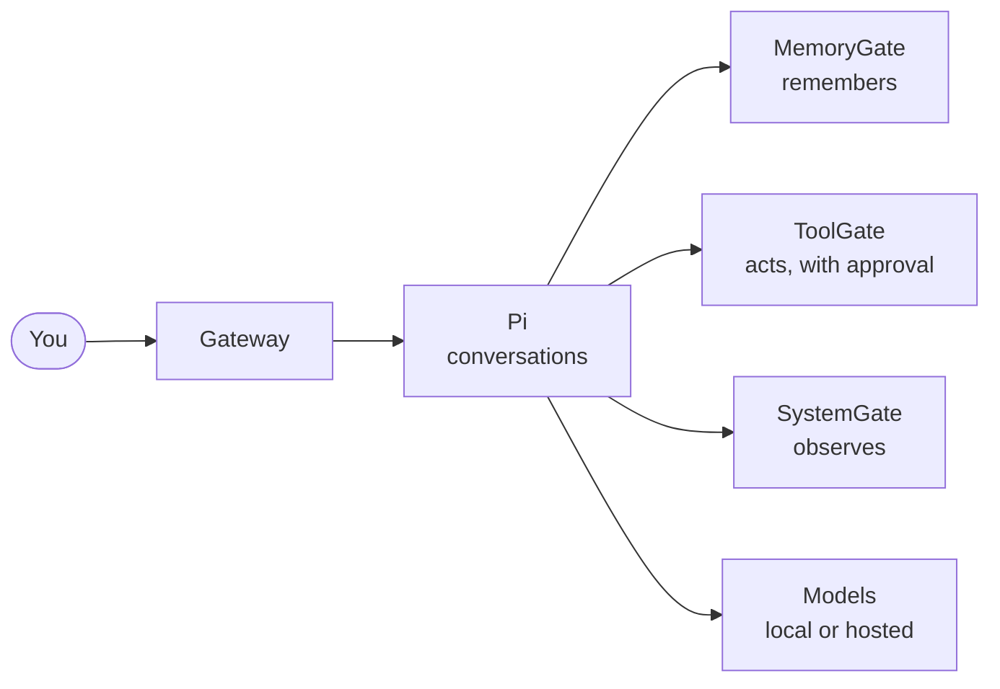

<p align="center"></p>
<h1 align="center">Conker</h1>
<p align="center"><b>A personal AI companion you host yourself.</b><br/>
It remembers you, shows its work, and never acts without your say.</p>
<p align="center">
  <a href="docs/1-overview.md">Overview</a> ·
  <a href="docs/2-how-it-works.md">How it works</a> ·
  <a href="docs/3-using.md">Using it</a> ·
  <a href="docs/4-running.md">Running it</a> ·
  <a href="docs/status.md">Status</a>
</p>


## What it does

- **Talks and remembers.** Memories carry their source, and you can see why it knows something.
- **Shows its work.** Every answer shows which memories, tools and model it used.
- **Asks before acting.** Actions go through one controlled gate. You approve the exact action, once.
- **Stays yours.** Runs on your hardware, on your private network, with local models by default.

> **Status:** early. Chat, memory, approvals and workflows work end to end on a real server. Calls,
> agents and the proposal engine are still preview or planned. [Full status](docs/status.md)

## Try it in 1 minute

Interface preview with sample data, no backend needed (Node.js 22.12+):

```sh
git clone https://github.com/Conker-AI/conker.git
cd conker/dashboard
npm ci
npm run dev -- --host localhost --port 5173 --strictPort
```

Open http://localhost:5173. To run the real thing on a server, see
[4 · Running Conker](docs/4-running.md).

## How it's built



Six small services, each in its own repository and usable on its own:
[pi](https://github.com/Conker-AI/pi) ·
[memorygate](https://github.com/Conker-AI/memorygate) ·
[toolgate](https://github.com/Conker-AI/toolgate) ·
[systemgate](https://github.com/Conker-AI/systemgate) ·
[embeddings](https://github.com/Conker-AI/embeddings).
More in [2 · How it works](docs/2-how-it-works.md).

## Docs

| | |
|---|---|
| [1 · Overview](docs/1-overview.md) | What Conker is, why, and the 10 words it uses |
| [2 · How it works](docs/2-how-it-works.md) | Diagrams: services, one message, one approval |
| [3 · Using Conker](docs/3-using.md) | Each screen and common tasks |
| [4 · Running Conker](docs/4-running.md) | Preview, server, local Windows stack |
| [5 · Developing](docs/5-developing.md) | Repos, checks, rules, decisions |
| [Status](docs/status.md) | What works today, and what doesn't |

## Credits

The frontend builds on [shadcnstore's dashboard template](https://github.com/shadcnstore/shadcn-dashboard-landing-template)
([notice](dashboard/THIRD_PARTY_LICENSES/shadcn-dashboard-template.txt)), React, Vite, Tailwind CSS
and Radix. MIT licensing is intended; a root `LICENSE` file is still to be added.
