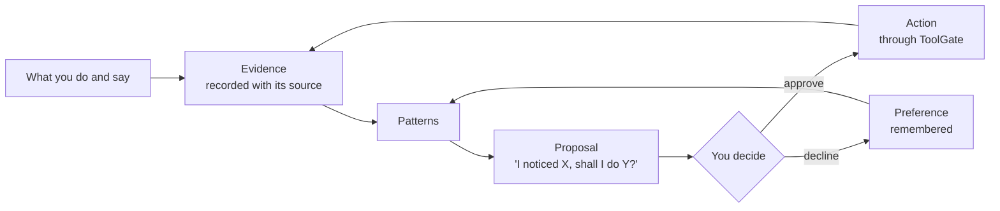

# 1 · What Conker is

**Conker is a personal AI companion you host yourself.** You talk to it; it remembers you; it
notices what you keep doing and proposes to take it off your hands; nothing real happens without
your approval.

It runs on your own machine or server, is reached over a private network, and is built from small
services that each do one job.

## Why it exists

The goal is to **give you back time**. The catch: supervising an AI also costs time — reading its
suggestions, approving its actions, fixing its mistakes. So Conker is designed to be *quiet*:

- It asks only when it must. Every notification spends your attention.
- It learns from "no". Declining a proposal teaches it; it should not ask the same thing twice.
- It gets quieter and more accurate over months. If it doesn't, it's broken.

## The loop

This is the whole product in one picture. Chat is how you talk to it; the loop is what it is for.

## Promises

| Conker will | Conker will never |
|---|---|
| Run on hardware you own and keep working offline with local models | Quietly send your life to a third party — you can always see which model answered |
| Show what it believes about you, with the source and how sure it is | Be confidently wrong about you — it says "I don't know you well enough" |
| Let you correct or forget any memory, and record that you did | Rewrite history — every turn and action is kept in order |
| Ask before any action that can't be undone, for that exact action only | Offer "always allow" |
| Show honest status: live, degraded, offline, preview… | Show a green badge for something that isn't actually working |

## Words you'll see

Only ten. Everything else is plain English.

| Word | Meaning |
|---|---|
| **Owner** | You — the one person an install serves. |
| **Companion** | The one assistant you talk to (named *Conker* by default; rename it). |
| **Pi** | The engine that runs conversations, picks models and calls tools. |
| **Gate** | A service that guards one boundary. There are three: **MemoryGate** (remembers), **ToolGate** (acts), **SystemGate** (observes the machine). |
| **Gateway** | The login front door the browser talks to. |
| **Evidence** | A permanent record that something happened, with its source. |
| **Memory** | Something Conker believes about you, derived from evidence, with a confidence level. |
| **Proposal** | Something Conker suggests doing, with the evidence behind it. |
| **Approval** | Your yes to one exact action. Used once, then it expires. |
| **Inbox** | Where proposals and approval requests wait for you. |

## Where to go next

- How the pieces fit: [2 · How it works](2-how-it-works.md)
- What each screen does: [3 · Using Conker](3-using.md)
- Install it: [4 · Running Conker](4-running.md)
- What actually works today: [Status](status.md)
