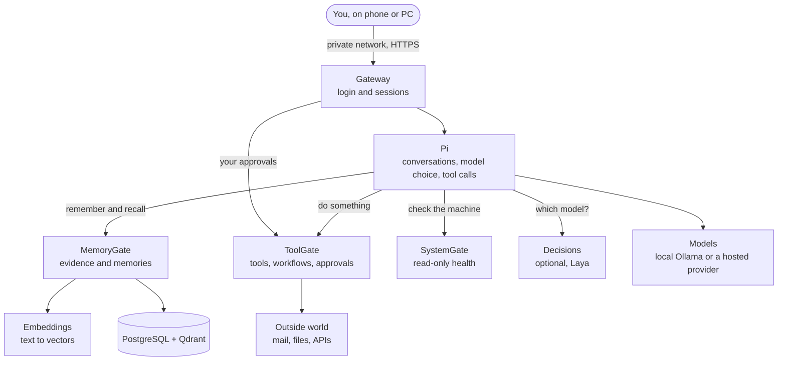
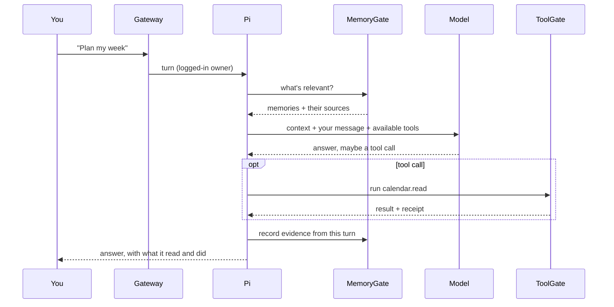
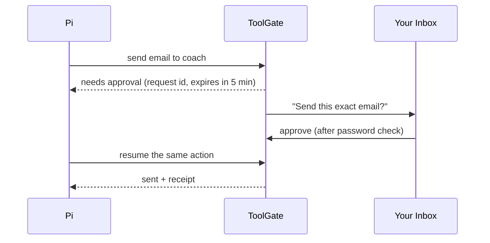

# 2 · How it works

Conker is six small services plus a web dashboard. Each service lives in its own repository and can
be used without the others.

## The pieces

| Service | Job | Never does |
|---|---|---|
| **Gateway** | Password login, browser sessions, serves the dashboard | Hand service keys to the browser |
| **Pi** | Runs each conversation turn, picks a model, calls tools | Store memories or act on the world directly |
| **MemoryGate** | Stores evidence, builds memories, finds relevant ones | Execute anything |
| **ToolGate** | Runs tools and workflows, asks for approval, keeps receipts | Decide what you value |
| **SystemGate** | Reports machine health (CPU, disk, containers, backups) | Run commands |
| **Embeddings** | Turns text into vectors for meaning-based search | Keep any data |
| **Decisions** *(optional)* | Picks between options with probabilities (routing, ranking) | Write answers or grant permissions |

**The one rule:** anything that touches the outside world goes through ToolGate. The browser only
ever talks to the Gateway.

## One message, start to finish

Every turn is saved in order and never edited. When a conversation gets too long, Pi closes it,
writes a summary and continues in a linked child conversation.

## When an action needs your approval

An approval is bound to that exact action and its arguments. It works once. A replay or an expired
approval is refused.

## What may happen without asking

| Kind of action | Example | Default |
|---|---|---|
| **Observe** | read, search, draft, propose | Free |
| **Prepare** | build or stage something, not run it | Free |
| **Act locally** | run a script, start a service | Asks |
| **Act outward** | send, post, spend money | Asks, with hard limits |

You can loosen or tighten each kind separately. Why these choices were made: [decisions](adr/).

## Where it runs

Everything runs in Docker on one machine. Only the Gateway is reachable, and only from your private
network (for example Tailscale). Databases and service APIs are not exposed. Local models keep
conversations on the machine; if you add a hosted model, each turn shows which provider answered.
