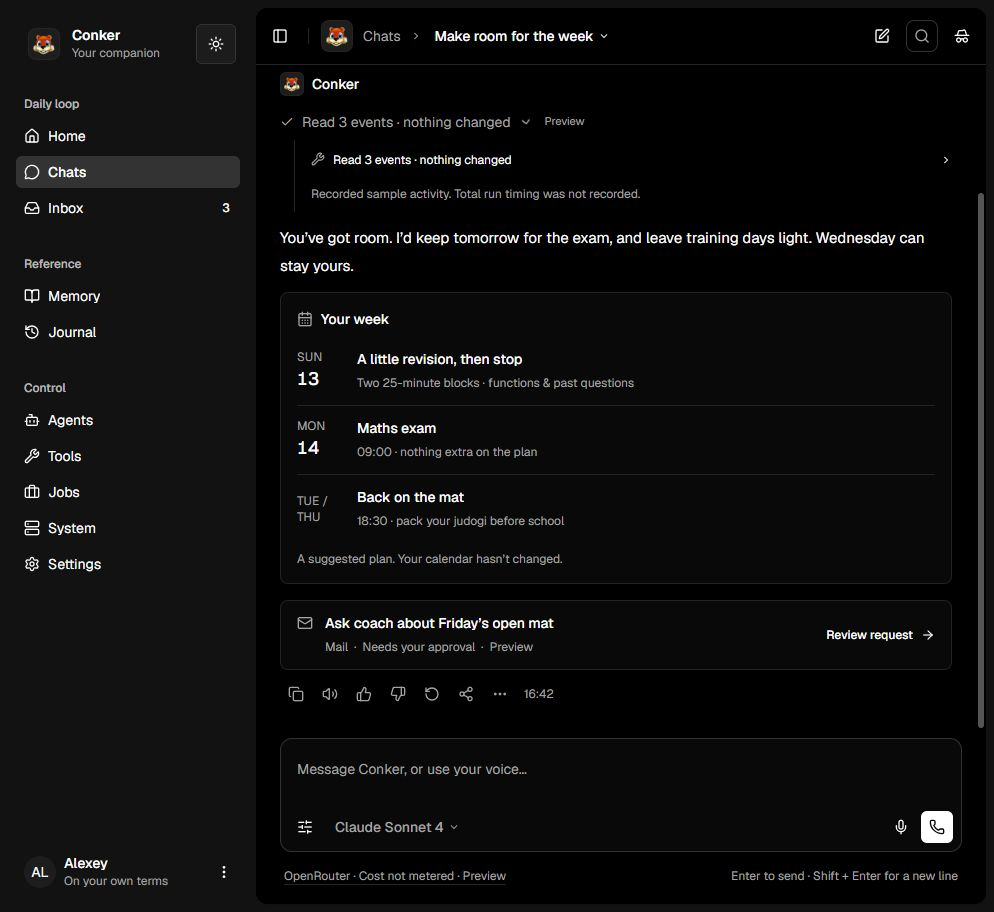
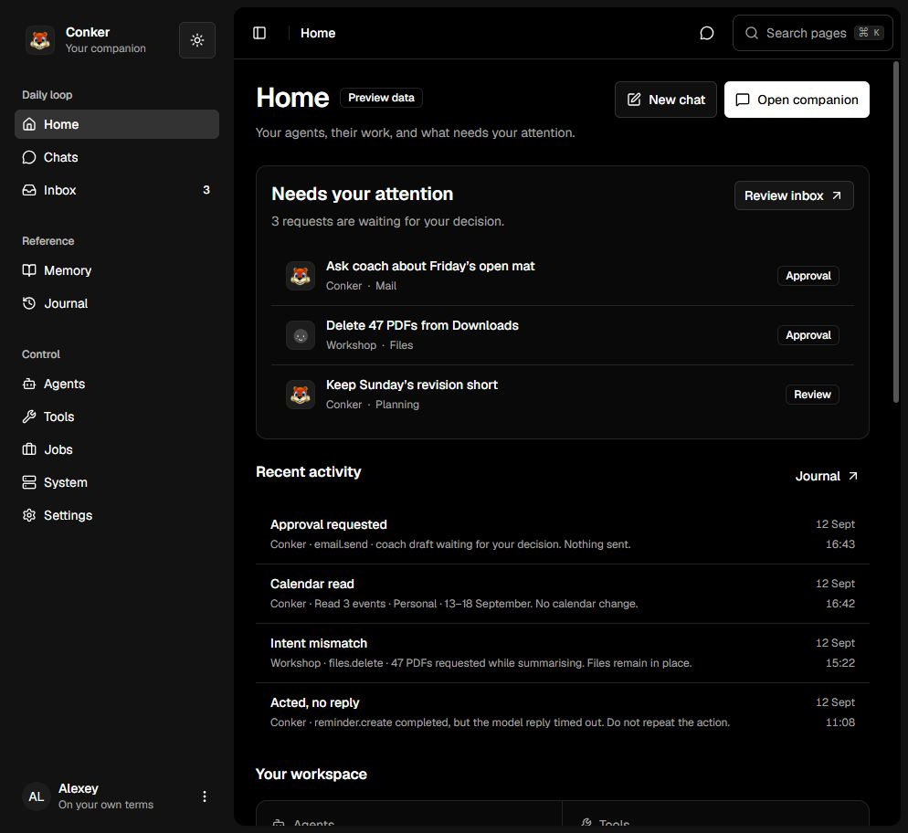

# 3 · Using Conker

A short guide to each screen. **Live** means it works with the real backend. **Preview** means the
screen is designed and clickable but uses sample data. Screens in preview say so on the page.
Details are in [Status](status.md).

## Signing in

Open your Conker address (for example `https://your-server:8443`) and enter the owner password set on
the server. Chatting needs no further password. Risky changes (approvals, settings, workflows) ask
for it again, for that one change only ([ADR-0010](adr/0010-conversation-writes-are-session-bound.md)).
Forgot it? Reset it on the server: see [4 · Running Conker](4-running.md#reset-the-password).

## The screens

### Companion and Chats: talk to it · **Live**

- **Companion** is your ongoing conversation. **Chats** are separate topic conversations.
- Under each answer you can open **what it did**: memories used, tools called, and which model
  answered.
- Answers appear as they are written; **Stop** ends one early and keeps what already happened.
- Choose a model in the composer, or let routing pick one.
- An action waiting for approval shows up as a card in the conversation, linked to the Inbox.

### Inbox: things waiting for you · **Live for approvals**

- **Approval requests:** the exact action, its arguments and when it expires. Approve or deny.
- **Proposals:** things Conker noticed in your messages and offers to take on, with the messages
  that prompted each one. **Accept**, **Not now** (hidden for 30 days) or **Never suggest this**.
  Accepting records your choice; nothing runs by itself. Turn it on by assigning a model to the
  Proposals role in Settings.

### Home: overview · **Partly live**

What needs your attention, recent activity and shortcuts. Sections that aren't connected yet say so.

### Memory: what it knows about you · **Live**

Search memories and see each one's source conversation. **Forget this memory** shows the exact text,
then removes it everywhere Conker stored it (confirm with your password); the chat it came from
stays until you forget that chat too. Correcting from this screen is planned. Search by meaning
needs the Embeddings service; unavailability is reported rather than silently treated as a
successful semantic match. Literal library search is a separate inspection path.

For automatic recall across new chats, open **Agents**, open the supplied **Companion**,
select **Harness**, and choose **Memory access -> Across my chats**. Saving requires owner verification
and applies to future turns. This explicit choice does not change tool permissions or grant
other agents/team roles access. Memory-disabled chats remain excluded. The default remains
**Current conversation**; a saved memory appearing in the library alone does not prove that
it was supplied to an answer. Check the turn's memory receipt for retrieval status and count.

### Journal: what happened · **Partly live**

Everything Conker did, in order: turns, tool calls, approvals, failures.

### Tools and workflows: what it can do · **Live**

See registered tools, and build workflows (branches, loops, steps) in the editor. Publish a workflow
and allow the companion to use it. Runs that need approval pause in the Inbox.

### Agents and Jobs · **Preview**

Agents behind the companion, and scheduled work. Designed, not yet connected.

### System: is the machine OK? · **Partly live**

Service health is live. Terminal, files and some telemetry are samples.

### Settings · **Live for models**

General contains profile, appearance, answers and ideas. **Providers** is its own
Settings tab for connections, the model catalogue and role assignments. **Search**
has its own tab too.

In **Settings > Providers > ChatGPT**, choose **Sign in with ChatGPT** and confirm
the exact operation with your Conker owner password. Open the provided OpenAI link
and enter the private one-time code there. This uses your ChatGPT/Codex subscription,
not an OpenAI API key. OpenAI plan limits and model availability still apply.
Device-code sign-in may need to be enabled in your ChatGPT security settings.
Then read the available models, add your selected model to the catalogue, save,
and choose it under General > Answers or in a chat. Connecting never changes
defaults or background-role eligibility automatically.

Credentials and automatic refresh stay in a separate private Codex home on this
server. Conker's tools still go through Pi and ToolGate; no Codex agent is started.
Disconnect stops this connection without revoking other OpenAI sessions. API-key
providers remain an optional, separate disclosure with their own spending switch.
**Character Studio** (`Settings → Companion`) sets your companion's name, personality, style and
voice. Voice cloning and 3D appearance are not connected yet.

### Calls · **Connected**

The call screen supports durable typed turns and bounded English voice turns when an
operator has configured a compatible speech service. The browser captures PCM only
after an explicit click; recordings and generated audio are discarded after the
request or playback, while the transcript remains in the call conversation. Camera,
continuous streaming, perception and incoming calls are not connected.

First-run setup reports voice readiness inside **Connect capabilities** without asking
for a provider key. Run `conker speech configure` on the Conker host for the guided
URL, model, voice and hidden-key prompts, then refresh setup. `conker speech status`
reports configuration only and never prints the credential; `conker speech disable`
removes the host configuration and recreates Pi.

## Common tasks

| I want to… | Do this |
|---|---|
| Ask something | Companion, type, Enter |
| Start a separate topic | Chats, then **New chat** |
| See why it said something | Open **what it did** under the answer |
| Approve an action | Inbox, open the request, **Approve**, confirm your password |
| Keep a conversation out of memory | Turn on **Incognito** for that chat |
| Use a stronger model | Settings, Models: add a provider, then assign it to *answering* |
| Let it run a workflow | Tools: publish the workflow, allow the companion to use it |
